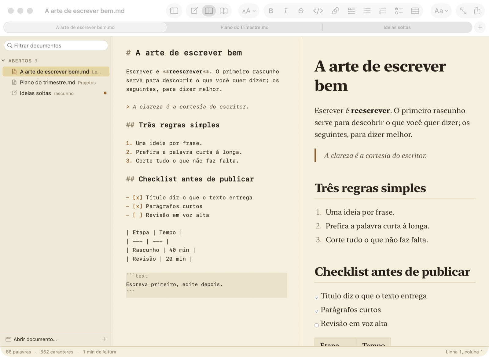
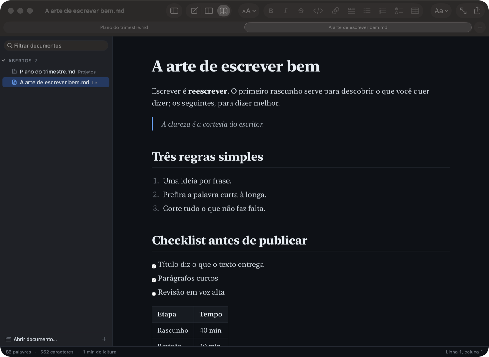

# Marcado

**Leitor e editor de Markdown nativo para macOS.** Abre seus arquivos `.md` com uma leitura
bonita, no estilo de site de notícias, e deixa editar quando precisa. Guarda o que você escreveu
mesmo sem salvar e, ao abrir de novo, volta exatamente de onde você parou.

Somente para macOS 14 Sonoma ou mais novo (inclui macOS 26). Feito em Swift e AppKit, sem Electron,
sem servidor e sem conta. A única conexão de rede é a do menu IA, opcional e só quando você usa.





> **English summary.** Marcado is a native macOS (14+) Markdown reader and editor written in
> Swift/AppKit. It opens plain `.md` files in tabs with a live preview and news-site style reading
> themes (Light, Sepia, Dark, Midnight) and a choice of fonts, size, column width and line height.
> Like Sublime Text, it restores your last session on launch, including never-saved notes, which
> survive quitting, rebooting and even a crash. A VS Code style sidebar lists open and recent
> documents. Also: formatting toolbar and shortcuts, find and replace, focus and typewriter modes,
> word count and reading time, HTML and paginated A4 PDF export. MIT licensed, commercial use
> allowed. Build with `./build-app.sh --install` (needs Xcode or Swift 5.9+). UI in Portuguese.

## Por que existe

A maioria dos editores de Markdown ou é pesada (Electron), ou é feita para escrever e não para
ler, ou esquece o que você digitou se não salvar. O Marcado junta três coisas: leitura
confortável de arquivos `.md` comuns, edição simples quando precisa, e a sessão que nunca se perde,
do jeito que o Sublime Text faz. Foi inspirado no FrankMD
([github.com/akitaonrails/FrankMD](https://github.com/akitaonrails/FrankMD)), mas é um app de
documentos do Mac, sem pasta de notas obrigatória, sem banco e sem servidor.

## O que faz

**Ler**
- Visualização renderizada com tipografia de leitura: títulos, listas, listas de tarefas,
  citações, tabelas, blocos de código com botão Copiar, imagens relativas ao arquivo e links.
- Temas: Claro (branco), Sépia (amarelado, estilo jornal), Escuro, Meia-noite e Automático, que
  segue o claro/escuro do sistema. O editor acompanha o tema.
- 9 fontes de leitura já presentes no macOS (New York, Georgia, Charter, Palatino, Iowan Old Style,
  San Francisco, Avenir Next, Helvetica Neue, SF Mono) e 5 fontes para o editor.
- Tamanho do texto, largura da coluna (estreita, média, larga) e entrelinha (compacta, normal, ampla).
- Três modos: só editor, editor e visualização lado a lado (com rolagem sincronizada) e só leitura.

**Abrir e organizar**
- Documentos em abas, como no Safari. Duplo clique no Finder abre no Marcado.
- Barra lateral no estilo do Explorador do VS Code: documentos abertos e recentes, com filtro,
  menu de contexto (Duplicar, Mostrar no Finder, Copiar caminho, Remover dos recentes) e arrastar
  e soltar.
- Duplicar (botão direito na barra lateral ou Arquivo > Duplicar, ⌥⇧⌘S) cria uma cópia salva ao
  lado do original, "Nome cópia.md", com o texto que está na tela, abre numa aba nova e já abre o
  campo para dar o nome novo. Dali em diante as mudanças gravam sozinhas nessa cópia. Rascunho sem
  arquivo vira outro rascunho.
- Tela de início focada em abrir, quando não há nada aberto.

**Nunca perder texto**
- Ao abrir o app, voltam as mesmas abas, na mesma ordem, com a mesma aba ativa.
- Texto escrito num documento novo, sem salvar, é gravado em disco a cada pausa na digitação.
  A aba leva o nome da primeira linha. O rascunho volta depois de encerrar, reiniciar o Mac ou
  até de o app ser encerrado à força.
- Arquivos já salvos gravam sozinhos (autosave do macOS, com versões e Reverter).

**Editar**
- Realce de sintaxe Markdown no editor.
- Barra de ferramentas e atalhos para negrito, itálico, riscado, código, títulos, citação, listas,
  lista de tarefas, link, imagem, bloco de código, tabela e linha horizontal. Aplicar de novo remove.
- Destacar texto em 8 cores, como no Notion e no Obsidian: amarelo, verde, azul, rosa, roxo,
  laranja, vermelho e cinza. Pela barra (clique repete a última cor, a setinha abre as cores),
  por Formatar > Destacar, pelo botão direito sobre o texto ou com ⇧⌘H. Amarelo grava `==texto==`
  (mesma sintaxe do Obsidian e do Typora); as outras cores gravam `<mark class="verde">texto</mark>`,
  que abre como destaque em qualquer leitor de Markdown. Dentro de um destaque, a mesma cor remove
  e outra cor troca. O editor já mostra o fundo colorido, e a exportação HTML e PDF mantém as cores.
- Colar imagem (⌘V com captura de tela ou imagem copiada): vira PNG em `anexos/` ao lado do
  documento (rascunho usa `Application Support/Marcado/Anexos/`) e entra como ``.
- Colar ou arrastar pasta ou arquivo do Finder (ou um caminho absoluto copiado) vira link; imagem
  vira ``. Formatar > Link para pasta ou arquivo… (⌥⌘K) abre o painel para escolher.
- Na visualização, link para pasta abre no Finder e link para arquivo abre no app padrão. Link do
  YouTube sozinho numa linha vira cartão com a thumbnail; clicar abre o vídeo.
- Quebra simples de linha aparece como quebra na visualização (Visualizar > Respeitar quebras de
  linha, ligado). Desligue para ler documentos já quebrados em 80 colunas como Markdown padrão.
- Localizar e substituir, verificação ortográfica, desfazer ilimitado.
- Modo foco (esconde tudo menos o texto) e máquina de escrever (linha atual sempre no meio).
- Contagem de palavras e caracteres, tempo de leitura e posição do cursor.

**IA (opcional)**
- Botão direito no editor > IA, ou o menu IA: Perguntar à IA (⌥⌘J, pedido livre), Resumir,
  Organizar em tópicos, Melhorar a redação, Corrigir ortografia e gramática, Deixar mais curto,
  Transformar em prompt, Extrair tarefas, Explicar e aprofundar, Continuar escrevendo e Traduzir
  para inglês.
- Vale para o trecho selecionado ou, sem seleção, para a nota inteira. No pedido livre com
  seleção, a nota inteira vai junto como contexto.
- A resposta aparece aos poucos num painel, onde dá para editar o pedido e gerar de novo, editar
  a resposta e escolher Substituir (seleção ou nota), Inserir abaixo ou Copiar. Substituir e
  inserir entram no desfazer (⌘Z).
- Marcado > Ajustes (⌘,): escolha entre a API da Claude (Anthropic) e a OpenRouter, com chave e
  modelo de cada uma. Padrões: `claude-opus-5` e `anthropic/claude-opus-5`. Botão Testar conexão.

**Exportar**
- HTML autônomo com o tema escolhido embutido.
- PDF A4 paginado, com texto selecionável, sem cortar linhas nem separar título do parágrafo.
- Impressão.

## Instalar

Não há binário pronto: compile na sua máquina. Requer macOS 14+ e Xcode 15+ (ou Command Line
Tools com Swift 5.9+). Não há Xcode project: é um Swift Package puro.

```sh
git clone https://github.com/cassiorox/marcado.git
cd marcado
./build-app.sh --install   # compila, monta build/Marcado.app, copia para /Applications e abre
```

O app é assinado ad hoc na sua máquina. Para os arquivos `.md` abrirem no Marcado com duplo
clique: menu **Marcado > Definir como app padrão para .md** (ou Finder > Obter informações >
Abrir com > Alterar tudo).

## Uso

| Ação | Atalho |
|---|---|
| Novo, Abrir, Salvar | ⌘N, ⌘O, ⌘S |
| Salvar como (igual ao Sublime), Duplicar | ⇧⌘S, ⌥⇧⌘S |
| Barra lateral (abertos e recentes) | ⌃⌘S |
| Tela de início | ⇧⌘0 |
| Só editor, Dividido, Leitura | ⌘1, ⌘2, ⌘3 |
| Modo foco (Esc sai) | ⇧⌘F |
| Máquina de escrever | ⇧⌘T |
| Aumentar, diminuir, tamanho padrão | ⌘+, ⌘-, ⌘0 |
| Próximo tema | ⌃⌘T |
| Localizar, Localizar e substituir | ⌘F, ⌥⌘F |
| Negrito, itálico, riscado, código | ⌘B, ⌘I, ⇧⌘X, ⌘E |
| Destacar com a última cor usada | ⇧⌘H |
| Link, imagem, link para pasta ou arquivo | ⌘K, ⇧⌘I, ⌥⌘K |
| Título 1 a 6, texto normal | ⌥⌘1 a ⌥⌘6, ⌥⌘0 |
| Link, imagem | ⌘K, ⇧⌘I |
| Citação, lista, numerada, tarefas | ⇧⌘., ⇧⌘L, ⇧⌘O, ⇧⌘C |
| Bloco de código, tabela, linha horizontal | ⇧⌘K, ⌥⌘T, ⌥⌘- |
| Exportar HTML, exportar PDF, imprimir | ⇧⌘E, ⌥⇧⌘E, ⌘P |
| Perguntar à IA, Ajustes | ⌥⌘J, ⌘, |
| Barra de status | ⌘/ |
| Quebrar linhas nos blocos de código (liga/desliga) | ⌥⌘L |

As ações de formatação alternam: aplicar de novo remove. Sem seleção, negrito/itálico pegam a
palavra do cursor e as de linha (título, lista, citação) valem para a linha atual.

Tema, fontes, tamanho, largura e entrelinha ficam no menu **Visualizar** e no botão "Aa" da barra;
valem para todas as janelas e são lembrados. O tema Automático segue o claro/escuro do sistema.

O salvamento é o padrão do macOS (autosave com versões): o arquivo em disco é atualizado
sozinho, e Arquivo > Reverter volta à última versão salva.

## Sessão e rascunhos (como o Sublime Text)

- Ao abrir, o app volta exatamente como estava: mesmas abas, na mesma ordem, com a mesma aba ativa.
  Sem sessão anterior, aparece a tela de início (abrir documento, recentes, arrastar arquivo).
  O app nunca abre um documento em branco sozinho.
- Texto escrito num documento novo, sem salvar, fica guardado. A aba leva o nome da primeira
  linha e mostra um ponto de "não salvo". Ele volta ao reabrir o app, depois de desligar o Mac e
  até depois de o app ser encerrado à força, porque é gravado em disco a cada pausa na digitação.
- Encerrar o app (⌘Q) não pergunta nada. Fechar a aba de um rascunho (⌘W) pergunta se quer
  salvar. Se escolher apagar, o texto ainda fica 30 dias em `Descartados`.
- Arquivos em `~/Library/Application Support/Marcado/`: `sessao.json` (abas), `Rascunhos/`
  (um `.md` por rascunho aberto) e `Descartados/`. São texto puro, sem criptografia.
- A barra lateral (⌃⌘S) lista os documentos abertos e os recentes, com filtro. Clique abre;
  o botão direito tem Duplicar, Mostrar no Finder, Copiar caminho e Remover dos recentes. Dá para
  arrastar arquivos para ela. A largura é ajustável e fica lembrada.

## Linha de comando

```sh
M=/Applications/Marcado.app/Contents/MacOS/Marcado
$M --export-html entrada.md saida.html [--tema claro|sepia|escuro|meianoite]
$M --export-pdf  entrada.md saida.pdf  [--tema ...]
$M --selftest    # formatação, documento, sessão e rascunhos (usa pasta temporária)
# MARCADO_DEBUG=1 liga o log da sessão; MARCADO_SUPPORT_DIR=/tmp/x isola sessão e recentes
```

## Arquitetura

```
Sources/Marcado/
  main.swift                  entrada; modos --export-* e --selftest rodam ANTES do NSApp.run
  AppDelegate.swift           menus, ações globais de aparência, app padrão, CLI
  Settings.swift              UserDefaults + notificação Settings.didChange; AppResources (pasta web)
  Theme.swift                 temas (paleta do editor), fontes, largura, entrelinha, ViewMode
  Document.swift              NSDocument (MarkdownDocument): texto UTF-8, autosave em local
  DocumentWindowController.swift  janela, NSToolbar, NSSplitView editor|preview, modos, foco, exportar
  StatusBar.swift             palavras, caracteres, tempo de leitura (200 ppm), linha/coluna
  SelfTest.swift              autoteste sem UI
  WelcomeWindowController.swift  tela de início (sem documentos abertos)
  Session/SessionStore.swift  sessão, rascunhos, recentes; MarcadoDocumentController
  Sidebar/SidebarView.swift   barra lateral (abertos e recentes) e ThemedSplitView
  Editor/MarkdownTextView.swift   NSTextView TextKit 1, largura máxima, máquina de escrever, linhas
  Editor/Attachments.swift    colar/arrastar imagem, pasta e arquivo; painel Link para pasta ou arquivo
  Editor/SyntaxHighlighter.swift  realce por regex no NSTextStorageDelegate (parágrafo editado)
  Editor/Formatter.swift          ações de formatação com desfazer
  Preview/PreviewView.swift       WKWebView com preview.html, render com atraso, rolagem sincronizada
  Preview/Exporter.swift          HTML autônomo e PDF A4 paginado
  AI/AIClient.swift           config (ia.json) e chamada com streaming (Anthropic Messages ou OpenRouter)
  AI/AIActions.swift          pedidos prontos, menu IA e abertura do painel
  AI/AIPanel.swift            folha com pedido, resposta ao vivo e Substituir/Inserir/Copiar
  AI/AISettings.swift         Marcado > Ajustes: provedor, chaves e modelos
Resources/
  Info.plist                  tipos de documento (net.daringfireball.markdown, texto simples)
  web/preview.html            página do preview (CSP bloqueia scripts do documento)
  web/preview.js              markdown-it + listas de tarefas + data-line para rolagem sincronizada
  web/themes.css              temas e tipografia de leitura (cores iguais às de Theme.swift)
  web/markdown-it.min.js      markdown-it 14.1.0 (MIT), offline
make-icon.swift               gera Resources/AppIcon.icns
```

## Armadilhas

- **Argumentos de linha de comando viram documentos.** Rodando dentro do `.app`, o
  NSDocumentController tenta abrir os caminhos passados na linha de comando e trava num alerta
  invisível. Por isso os modos `--export-*` e `--selftest` rodam em `main.swift` antes do `NSApp.run()`.
- **PDF não usa NSPrintOperation do WKWebView.** Fora da tela ela entra em loop e gera PDF de
  centenas de MB. O Exporter usa `createPDF` (uma página contínua na largura útil do A4) e fatia em
  páginas no CoreGraphics, quebrando antes de parágrafos, itens e linhas de tabela (nunca logo
  depois de um título). O texto continua vetorial.
- **Cores em dois lugares:** `Theme.swift` (editor) e `web/themes.css` (preview e exportação).
  Tema novo exige mexer nos dois.
- **Editor em TextKit 1** (NSLayoutManager explícito) para ter geometria de linha estável na
  máquina de escrever e na rolagem sincronizada.
- O scroll view do editor tem `automaticallyAdjustsContentInsets = false`; sem isso ele abria
  rolado 28 pt para baixo.
- **Colar intercepta só o que não é texto comum.** `paste(_:)` trata arquivos/pastas do Finder,
  caminho absoluto existente e imagem sem texto junto; o resto segue para o NSTextView. A ordem
  importa: texto vem antes de imagem, senão cópia de planilha (texto + TIFF) viraria PNG.
- **Quebras de linha.** `breaks: true` no markdown-it é o padrão do app (Cassio escreve uma ideia
  por linha); o Markdown puro juntaria as linhas num parágrafo só. O ajuste vem no objeto de
  `marcado.apply`, que troca a opção e re-renderiza o último texto, e vai também para
  `renderHTML(t, breaks)` na exportação. Por causa disso o cartão do YouTube procura link sozinho
  na LINHA (entre quebras), não só no parágrafo inteiro.
- **Link de pasta no preview.** O caminho vai entre `<>` quando tem espaço (CommonMark); o WebKit
  resolve como `file://` e `decidePolicyFor` cancela a navegação e manda para `NSWorkspace.open`,
  que abre pasta no Finder e arquivo no app padrão. Cartão do YouTube é regra do markdown-it
  (`youtube_cards`), então vale também na exportação.
- **Largura do editor segue o painel à força.** Com a janela em segundo plano (aba não visível,
  troca de modo, redimensionamento) o `autoresizingMask` do NSTextView não acompanhava o clip view:
  o texto ficava com a largura antiga, cortado na borda do painel, e a barra de rolagem aparecia
  solta no meio da janela (faixa cinza tracejada). `MarkdownTextView.fitWidthToClip()` ajusta a
  largura e zera o deslocamento horizontal a cada mudança de frame do clip view (só a largura:
  chamar `sizeToFit` ali, no meio do layout, deixava linhas fantasmas depois do Enter); a janela
  também refaz o layout dos split views ao virar chave (`relayoutPanes`).
- **Divisor com painel escondido.** Ao trocar de modo, o NSSplitView deixava o divisor onde estava
  (linha cinza no meio do editor no "Só editor") até um redimensionamento. `placeDivider` empurra
  o divisor para a borda (fim no editor, início na leitura) e o delegate só aplica o mínimo de
  240 pt no modo dividido, senão o empurrão é travado a 240 pt da borda.
- **Cores de destaque em dois lugares também:** `HighlightColor.colors(for:)` em `Theme.swift` e as
  variáveis `--mark-*` em `themes.css`, uma linha por tema. O `==texto==` é regra própria no
  `preview.js` (o markdown-it não traz); `<mark class>` passa porque o preview tem `html: true`.
- **IA por HTTP puro.** Não há SDK da Anthropic para Swift: `AIClient` chama `/v1/messages` com
  `stream: true` e lê o SSE (`content_block_delta`/`text_delta`). Em `claude-opus-5` e
  `claude-fable-5-1` vai `fallbacks: "default"` (cabeçalho `server-side-fallback-2026-07-01`):
  se o classificador recusar, a API refaz no modelo recomendado; outros modelos não aceitam.
  OpenRouter usa `/api/v1/chat/completions` (formato OpenAI, `choices[0].delta.content`).
- **Chaves em arquivo, não no Keychain.** O app é assinado ad hoc e cada compilação muda a
  identidade; no Keychain o macOS pediria a senha a cada atualização. `ia.json` fica com
  permissão 600 na pasta do app. `MARCADO_SNAPSHOT=/pasta --selftest` grava PNG do painel e dos
  Ajustes para conferir o layout sem abrir janela.
- O realce recalcula o documento inteiro quando a edição envolve cercas de código (```` ``` ````)
  ou colagens grandes; do contrário só o parágrafo editado.
- **Sessão é do app, não do sistema.** A restauração de janelas do macOS fica desligada
  (`NSQuitAlwaysKeepsWindows`) e as janelas não são restauráveis; senão as abas duplicam.
- **Clique no Dock:** `applicationShouldHandleReopen` devolve `false` (senão o AppKit abre um
  documento em branco), então é o app quem traz a janela de volta. `makeKeyAndOrderFront` não
  desminimiza; janela minimizada precisa de `deminiaturize`, e janela que ficou fora de todas as
  telas (monitor desconectado) é recentralizada. Sem isso o clique no Dock não fazia nada.
- **Encerrar sem alerta:** `MarcadoDocumentController.reviewUnsavedDocuments` grava a sessão e zera a
  marca de alterado dos rascunhos já gravados em disco antes do AppKit revisar documentos. Se o
  encerramento for cancelado, a marca volta em 3 s.
- Rascunho que nasce com texto (Duplicar, restauração) precisa atualizar nome e cópia em disco em
  `makeWindowControllers`, porque não passa pela digitação.
- O primeiro `NSDocumentController` criado vira o compartilhado: `main.swift` cria o
  `MarcadoDocumentController` antes de qualquer acesso a `NSDocumentController.shared`.
- A barra de ferramentas guarda a configuração por identificador. Item novo na barra exige trocar
  o identificador (hoje `MarcadoToolbar3`), senão quem já usou o app não vê o item.

## Licença

MIT. Pode usar, copiar, modificar, distribuir, sublicenciar e **vender**, inclusive em produtos
comerciais e de código fechado, desde que o aviso de copyright e a licença acompanhem as cópias.
Veja [LICENSE](LICENSE).

O markdown-it incluído em `Resources/web/markdown-it.min.js` é de outros autores, também sob licença
MIT (github.com/markdown-it/markdown-it).

Projeto pessoal de Cassio Prado. Não há suporte formal, mas issues e pull requests são bem-vindos.
